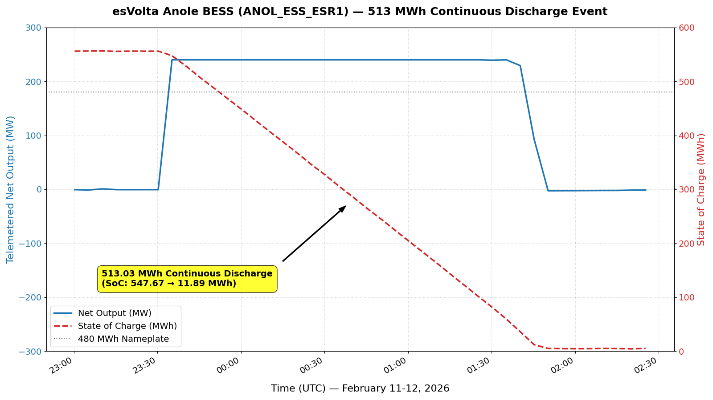
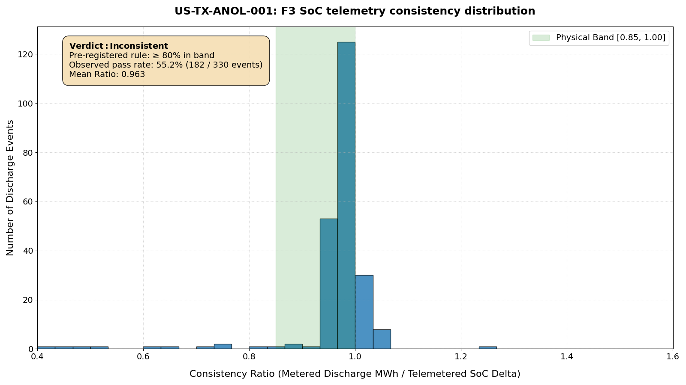

# ERCOT Anole ESS Independent Audit (US-TX-ANOL-001)

Independent verification of the public nameplate claims of the Anole battery
energy storage system (esVolta / operator of record per ERCOT registration;
resource `ANOL_ESS_ESR1`, Seagoville, TX) — **240 MW / 480 MWh** — from ERCOT
SCED 60-day disclosure telemetry, under the VolMax P10 Verification Protocol
(v1.0). First audit in the VolMax series with an operator-reported
state-of-charge (SoC) field in the ground-truth anchor.

**Audit window:** 5 December 2025 (RTC+B go-live) – 30 April 2026, 5-minute
SCED intervals (~42,900 records).

## Limitations first

1. **Anchor class B (third-party rendering).** Data was retrieved from the
   gridstatus.io API, not from ERCOT MIS directly. ERCOT's web application
   firewall blocks non-US and public-datacenter IP ranges; a GitHub Actions
   US-runner probe (run ID `29136602701`, log public) was also blocked. The
   provenance chain therefore terminates at gridstatus.io's rendering of the
   ERCOT disclosure; the primary ERCOT artifact is not independently hashed.
   Details in `audits/US-TX-ANOL-001/sources.md`.
2. **SoC is operator-reported state estimation, not an independent
   measurement.** SoC-based findings verify the internal consistency of the
   operator's own SoC accounting — not absolute cell energy.
3. **SoC field semantics unresolved (F4 deferred).** Observed maximum SoC is
   558.0 MWh, +80.3 MWh above the public nameplate. Whether this reflects DC
   oversizing, a different measurement point, or field semantics awaits ERCOT
   column documentation. All SoC values in this report carry this caveat.
4. **5-minute resolution floor.** Sub-interval dynamics are not observable;
   maximum power findings are 5-minute telemetry values.
5. **Pre-registration disclosure.** Verdict rules (F1–F4) were frozen in a
   git commit made after the data pull but before any analysis ran; the gap
   is declared in the commit message and in
   `audits/US-TX-ANOL-001/selection_rationale.md`. December 2025 anomalies
   coincide with the RTC+B market transition and are documented, not repaired.

## Verdict ledger

| Rule | Claim | Verdict | Key evidence |
|---|---|---|---|
| F1 | 240 MW power capacity | **Demonstrated** | Max telemetered output 240.0 MW — exactly at the HSL/base-point ceiling (SCED model saturation noted) |
| F2 | 480 MWh energy capacity | **Demonstrated** | Largest contiguous discharge block: **513.03 MWh** over 2.17 h (2026-02-11). Verdict rests on metered energy (∫ telemetered output) alone, independent of the SoC field |
| F3 | SoC telemetry internal consistency | **Inconsistent** (per frozen rule) | 55.2% of evaluable discharge events fall in the physical band [0.85, 1.00]; frozen threshold was ≥80%. Exploratory post-hoc stratification (not pre-registered): events ≥10 MWh pass at 81.8%, indicating micro-events dominate the inconsistency — recorded as a hypothesis for future pre-registration, not as a verdict modifier |
| F4 | SoC field semantics | **Deferred** | Max observed SoC 558.0 MWh (+16.7% over nameplate); interpretation awaits official column documentation |

### Visualized Findings

#### Panel 1 — The February 11 Event (513 MWh Continuous Discharge)

#### Panel 2 — F3 Telemetry Consistency Distribution (F3 Histogram)

The largest F2 block drew SoC from 547.67 to 11.89 MWh; the discharge-side
SoC-accounting ratio for that event is 0.958 (this is a one-way
discharge-vs-SoC ratio, **not** round-trip efficiency).

## Reproducibility

- `analysis.py` — single entry point; regenerates
  `audits/US-TX-ANOL-001/metrics.json`, from which the report renders. Block
  segmentation breaks on data gaps >600 s, non-ON telemetry status, and
  non-positive output; energy is integrated trapezoidally over actual
  timestamps. An internal physics gate halts execution if any block's energy
  exceeds the observed SoC bound — faulty verdicts are structurally
  unreachable.
- `pull_anole.py` — re-fetches the window from the gridstatus.io API (free
  key required, `.env.template` provided). Raw CSVs are **not redistributed**
  in this repository (gridstatus.io terms prohibit redistribution of raw
  exports); SHA-256 hashes of the frozen pull are pinned in
  `audits/US-TX-ANOL-001/data_manifest.json`. A fresh pull may differ if
  ERCOT issues corrections — the manifest records the pull timestamp.
- Pre-registration commits, claim pins (with archive snapshots), selection
  rationale, and the ERCOT correction-notice handling (M-B020626-01) are in
  `audits/US-TX-ANOL-001/`.

## Licensing

Code: MIT. Report and derived metrics: CC BY 4.0. Underlying market data:
© ERCOT, used per ERCOT website Terms of Use (raw-data reproduction
permission quoted in `sources.md`); retrieval layer subject to gridstatus.io
terms (no raw redistribution).

## Citation

Nestorov, Ivan (VolMax Studio Lab). *ERCOT Anole ESS Independent Audit
(US-TX-ANOL-001).* VolMax P10 Verification Protocol v1.0. DOI: [pending].

---
*VolMax Studio Lab · Independent verification of battery & energy-storage
claims · [volmax-studio.rs](https://volmax-studio.rs)*
